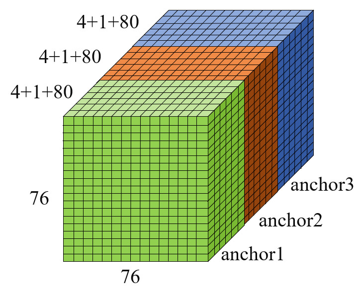
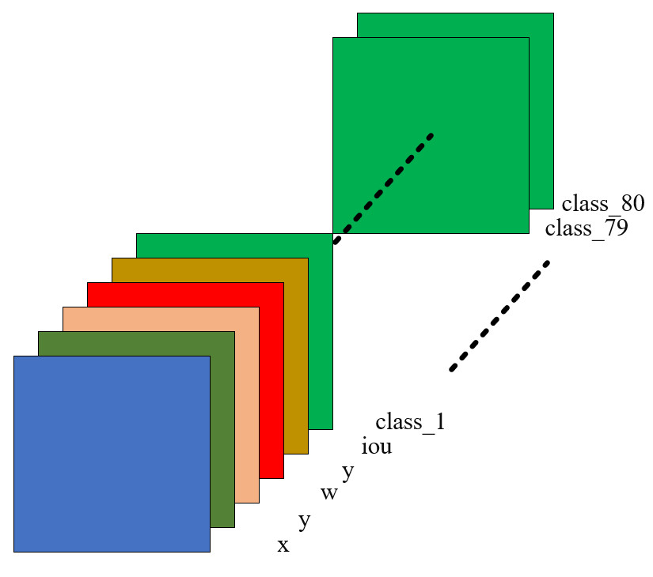

# Electricity-Inspection-Based-Ascend310

​		借助于Ascend310 AI处理器完成深度学习算法部署任务，应用背景为变电站电力巡检，基于YOLO v4算法模型对常见电力巡检目标进行检测，并充分利用Ascend310提供的DVPP等硬件支持能力来完成流媒体的传输、处理等任务，并对系统性能做出一定的优化。

## 目录结构与说明：

>
> 
> ./  
> |------build: cmake目录  
> |------data:  输入数据文件夹  
> |------iamge：档记录图片文件夹  
> |------inc：  工程include文件夹  
> |------model：模型文件存放目录  
> |------out：生成的可执行文件存放目录  
> |------presenterserver：视频服务器  
> |------result：程序输出的结果保存目录  
> |------script：打开presenterserver的脚本文件  
> |------src：  工程源代码目录  
> |              |------acl.json：acl初始化配置文件  
> |              |------VideoMain.cpp：输入视频或者RTSP流的处理函数  
> |              |------ImageMain.cpp:输入图片的处理主函数  
> |------build.sh:对整个工程进行编译  
> |------load.sh:从Atlas200DK上下载日志文件、输出文件的脚本  
> |------upload.sh:上传可执行文件脚本  
> |------upload_all.sh：上传工程所有文件的目录  
> |------video_main.sh:输入为视频的执行脚本  
> |------rtsp_main.sh:输入为rtsp视频流的执行脚本  
> |------image_main.sh:输入为图片的执行脚本  


# 一 网络模型的部署

​        目前只在Atlas200DK上完成开源YOLO v4网络的部署，由于YOLO含有mish算子，该算子在Atlas200DK现有的版本支持度高，仅在ONNX框架下支持，因此需要将Pytorch下的YOLO v4转换成ONNX，再转换为OM文件。

> **[YOLO v4论文地址]**：(https://arxiv.org/abs/2004.10934)

- 模型文件获取地址：（https://github.com/Tianxiaomo/pytorch-YOLOv4）

    >**输入输出数据**
    >
    >- 输入数据
    >
    >| 输入数据 | 分辨率  | 数据类型 | 数据排布格式 |
    >| :------- | ------- | -------- | ------------ |
    >| input    | 608*608 | RGB_FP32 | NCHW         |
    >
    >- 输出数据
    >
    >    输出数据分别对应模型的三个输出，shape为1x255x76x76，其中1为batch数，255则为3*85，表示每个cell预测3个bbox，85为4个坐标+1个置信度+80分类概率，后两个为特征图大小，其他两个特征图对应为38x38，19x19
    >
    >| 输出数据      | 大小（feature map） | 数据类型 | 数据排布格式 |
    >| ------------- | ------------------- | -------- | ------------ |
    >| feature_map_1 | -1x255x76x76        | FLOAT32  | NCHW         |
    >| feature_map_2 | -1x255x38x38        | FLOAT32  | NCHW         |
    >| feature_map_3 | -1x255x19x19        | FLOAT32  | NCHW         |
    >
    
- 获取权重文件之后，修改修改demo_pytorch2onnx.py源码，只保留模型Backbone，去除不支持的后处理算子

    ```python
    def transform_to_onnx(weight_file, batch_size, n_classes, IN_IMAGE_H, IN_IMAGE_W):
        model = Yolov4(n_classes=n_classes, inference=False)  # inference改为False即可去除后处理算子
        pretrained_dict = torch.load(weight_file, map_location=torch.device('cuda'))
        model.load_state_dict(pretrained_dict)
        input_names = ["input"]
        output_names = ['feature_map_1', 'feature_map_2', 'feature_map_3']  # 输出节点改为三个
    
        dynamic = False
        if batch_size <= 0:
            dynamic = True
    
        if dynamic:
            x = torch.randn((1, 3, IN_IMAGE_H, IN_IMAGE_W), requires_grad=True)
            onnx_file_name = "yolov4_-1_3_{}_{}_dynamic.onnx".format(IN_IMAGE_H, IN_IMAGE_W)
            dynamic_axes = {"input": {0: "-1"}, "feature_map_1": {0: "-1"},
                            "feature_map_2": {0: "-1"}, "feature_map_3": {0: "-1"}}
            # Export the model
            print('Export the onnx model ...')
            torch.onnx.export(model,
                              x,
                              onnx_file_name,
                              export_params=True,
                              opset_version=11,
                              do_constant_folding=True,
                              input_names=input_names, output_names=output_names,
                              dynamic_axes=dynamic_axes)
    
            print('Onnx model exporting done')
            return onnx_file_name
    ```

    运行脚本：

    ```python
    python3.7 demo_pytorch2onnx.py yolov4.pth data/dog.jpg -1 80 608 608
    ```

    >**转换失败可能原因**
    >
    >环境不匹配，缺少pytorch，安装pytorch步骤如下：
    >
    >- 在官网下载anaconda：https://www.anaconda.com/download/#linux
    >
    >- 进入anaconda安装包路径，输入命令进行安装
    >
    >    ```sh
    >    bash Anaconda3-2020.11-Linux-x86_64.sh
    >    ```
    >
    >- 安装结束之后测试
    >
    >    ```sh
    >    conda --version
    >    conda upgrade --all
    >    which python
    >    ```
    >
    >- 创建虚拟环境：`conda create -name ascend python=3.7.5`
    >
    >- 进入虚拟环境安装 prtorch  CPU版本
    >
    >    ```sh
    >    source activate ascend  deactivate退出
    >    根据具体的硬件环境对应得命令安装pytorch 
    >    ```
    >
    >    [pytorch官网](https://pytorch.org/)

- 替换resize算子，生成的yolov4_-1_3_608_608_dynamic_dbs.onnx可用ATC工具转换为离线om模型。

    ```sh
    # 替换Resize节点
    for i in range(len(model.graph.node)):
        n = model.graph.node[i]
        if n.op_type == "Resize":
            # print("Resize", i, n.input, n.output)
            model.graph.initializer.append(
                onnx.helper.make_tensor('scales{}'.format(i), onnx.TensorProto.FLOAT, [4], [1, 1, 2, 2])
            )
            newnode = onnx.helper.make_node(
                'Resize',
                name=n.name,
                inputs=ReplaceScales(n.input, 'scales{}'.format(i)),
                outputs=n.output,
                coordinate_transformation_mode='asymmetric',
                cubic_coeff_a=-0.75,
                mode='nearest',
                nearest_mode='floor'
            )
            model.graph.node.remove(model.graph.node[i])
            model.graph.node.insert(i, newnode)
            print("replace {} index {}".format(n.name, i))
    ```

    运行脚本：

    ```sh
    python3.7 dy_resize.py yolov4_-1_3_608_608_dynamic.onnx
    ```

- 离线模型转换

    - 配置环境变量：

        ```sh
        export install_path=/home/winston/Ascend/ascend-toolkit/latest
        export PATH=/usr/local/python3.7.5/:$PATH
        export PATH=/home/winston/Ascend/ascend-toolkit/latest/atc/ccec_compiler/bin:/home/winston/Ascend/ascend-toolkit/latest/atc/bin:$PATH
        export ASCEND_OPP_PATH=/home/winston/Ascend/ascend-toolkit/latest/opp
        export ASCEND_AICPU_PATH=/home/winston/Ascend/ascend-toolkit/latest/
        export ASCEND_SLOG_PRINT_TO_STDOUT=1
        ```
        
    - 模型转换

        out_node的设置根据模型而定，最后三个卷积层的输出节点名称

        ```sh
    atc --model=yolov4_-1_3_608_608_dynamic_dbs.onnx --framework=5 --output=yolov4 --input_format=NCHW --log=info --soc_version=Ascend310 --input_shape="input:1,3,608,608" --out_nodes="Conv_402:0;Conv_418:0;Conv_434:0" --insert_op_conf=aipp.config
        ```
    
- 开发过程中出现的一些问题记录如下：

    1. [后处理代码开发问题](###后处理代码开发问题):happy:

        Ascend310目前版本并不支持YOLO v4的后处理代码，因此采用C++代码自己实现后处理代码，C++代码参考YOLO v3后处理C++代码和YOLO v4后处理Python代码进行编写测试。

    2. [出现opencv和ffmpeg动态链接库找不到](###openv和ffmpeg动态链接库找不到解决办法):happy:
    
        

# 二 部署电网检测模型，模型为Darknet框架

利用[darknet2onnx开源工具](https://gitee.com/ye-hanyu/pytorch-YOLOv4/tree/master#https://pan.baidu.com/s/1dAGEW8cm-dqK14TbhhVetA)来进行Darknet框架下的YOLO v4模型转换到ONNX模型。

- 修改`darlnet2onnx`文件和`darknet2pytorch文件`，去除后处理算子，然后运行以下命令进行转换，见[后处理去除](#3.3 后处理去除)

    ```sh
     python3.7 demo_darknet2onnx.py ./electricity_yolov4_darknet/network_final.cfg ./electricity_yolov4_darknet/network_final.weights ./data/dog.jpg 0
    ```

- 利用onnxsim简化模型

    ```sh
    pip3 install onnx-simplifier
    python3 -m onnxsim --skip-optimization  yolov4_1_3_608_608.onnx yolov4_1_3_608_608_sim.onnx
    ```

- 替换动态resize算子为静态算子，运行脚本：`python3.7 dy_resize.py yolov4_-1_3_608_608_dynamic.onnx`,出现[转换错误](#3.4 ATC转换失败)

- 运行脚本进行转换：

    ```sh
    atc --model=yolov4_1_3_608_608_sim_dbs.onnx --framework=5 --output=yolov4_power --input_format=NCHW --log=info --soc_version=Ascend310 --input_shape="input:1,3,608,608" --out_nodes="Conv_388:0;Conv_404:0;Conv_420:0" --insert_op_conf=aipp.config
    ```

    转换出现错误，在昇腾论坛提出问题帖子：[求助](https://bbs.huaweicloud.com/forum/forum.php?mod=viewthread&tid=117996)

    [转换过程出现的问题记录](#3 YOLO v4 Darknet到ONNX出现的问题)

### 1 后处理代码开发问题:smile:

`yolov4_model_convert`文件夹中提供了YOLO v4的后处理脚本（`bin_to_predict_yolov4_pytorch.py`)。由于模型转换的过程中去除了YOLO v4的后处理代码，因此在程序运行的过程中看不到相应的处理结果，为完成YOLO v4的后处理模块，采用以下步骤：

1. 首先采用的方案是利用yolo v3的后处理代码来进行替换，但是进行处理的结果发现不正确，初步定为解算不正确

2. 将模型推理的结果（在创建的模型输出的时候将三个`feature map`存放到一个vector数组中）保存到一个二进制文件中（`.bin`文件），将其拷贝到`ATC YOLO v4`的文件夹中利用python文件进行后处理，得到的输出结果正确，确定模型转换过程正确，推理结果正确，出错的环节是后处理（解算+NMS）。

    - python代码命令：

        ```python
        python3.7 bin_to_predict_yolov4_pytorch.py --bin_data_path ./result/ --det_results_path ./detection-results/ --origin_jpg_path ./data/ --coco_class_names ./coco2014.names 
        #在ModelProcess.cpp文件中将三个feature_map保存为二进制文件中存放到 yolov4_model_convert下的result目录下，图·图片也需要保存下来存放到data目录下，然后使用上面的命令进行后处理
        ```

3. 对比C++后处理代码和Python后处理代码，发现代码整体思路一致，唯一有问题的是进行解算的时候不知道输出的数据排布格式是什么样的。

4. 利用Pycharm工具调试来debug，发现排布格式为NCWH，如下图所示:shape为1x255x76x76，其中1为batch数，255则为3x85，表示每个cell预测3个bbox，85为4个坐标+1个置信度+80分类概率，后两个为特征图大小，其他两个特征图对应为38x38，19x19。以76x76的为例，特和曾图大小为76x76，通道数为255，依次分别是{x，y，w，h，iou，class1_iou, ......, class80_iou}。因此模型输出文件保存为二进制格式的存放方式为现存放x，再存放y，依次存放，最后存放80类的分类iou。这一点是在后处理解算过程中需要注意的点。

                                                         


### 2 openv和ffmpeg动态链接库找不到解决办法:smile:

1. 首先确定是否将Atlas200Dk上的相关目录拷贝到服务器上，主要有`/usr/lib/aarch64-linux-gnu`和`/home/HwHiAiUser/ascend_ddk/arm`，`/usr/lib64/`三个目录

2. 利用`sudo find / -name libopencv_...`类似的命令查找位置，将对应路径按照下面所示的步骤添加到环境变量中

3. 然后将这些动态链接库添加到相应的路径

    ```sh
    1 修改LD_LIBRARY_PATH，命令如下：
    vi ~/.bashrc 
    在最后一行加入export LD_LIBRARY_PATH=/usr/lib64:/home/winston/Ascend/acllib/lib64:/home/winston/ascend_ddk/arm/lib:$LD_LIBRARY_PATH
    	source ~/.bashrc
    	sudo ldconfig
    	
    2 修改/etc/ld.so.conf，命令如下：
    	vim /etc/ld.so.conf.d/atlas.so.conf
    	将动态链接库的路径添加在这个文件的最后。
    	/usr/lib64
    	/home/winston/Ascend/acllib/lib64
    	/home/winston/ascend_ddk/arm/lib
    	sudo ldconfig
       
    在开发环境编译的时候需要指定cmake编译器，涉及到交叉编译工具
    	cmake ../src -DCMAKE_CXX_COMPILER=aarch64-linux-gnu-g++ -DCMAKE_SKIP_RPATH=TRUE
    ```

- 使用ldconfig的出现以下问题：

    ```sh
    /sbin/ldconfig.real:/home/winston/ascend_ddk/lib/libprotobuf.so.19 is not a symbolic link
    ```

    解决办法如下：

    - 首先检查链接：`sudo ldconfig -v`

    - 然后找到错误的链接信息

        ```sh
        # /sbin/ldconfig.real
        /sbin/ldconfig.real:/home/winston/ascend_ddk/lib/libprotobuf.so.19 is not a symbolic link
        ```

    - 根据错误信息查看该文件软链接到哪个文件

        ```sh
        ls -lh /home/winston/ascend_ddk/arm/lib/libprotobuf.so.19
        lrwxrwxrwx 1 root root 21 Mar  5 15:45 /home/winston/ascend_ddk/arm/lib/libprotobuf.so.19 -> libprotobuf.so.19.0.0
        发现应该链接到一个文件
        ```

    - 建立软链接

        ```sh
        sudo ln -sf /home/winston/ascend_ddk/arm/lib/libprotobuf.so.19.0.0 /home/winston/ascend_ddk/arm/lib/libprotobuf.so.19
        ```


### 3 YOLO v4 Darknet到ONNX出现的问题

- 出现convalution havn't activate linear：不影响转换过程:smile:

* 直接在命令行出现exit code 137，内存不足：:smile:

    ```sh
    /home/winston/.local/lib/python3.7/site-packages/numpy/core/function_base.py:120: TracerWarning: Converting a tensor to a Python index might cause the trace to be incorrect. We can't record the data flow of Python values, so this value will be treated as a constant in the future. This means that the trace might not generalize to other inputs!
      num = operator.index(num)
    /home/winston/AscendProjects/models/Electricity_model/pytorch-YOLOv4-master/tool/yolo_layer.py:227: TracerWarning: torch.tensor results are registered as constants in the trace. You can safely ignore this warning if you use this function to create tensors out of constant variables that would be the same every time you call this function. In any other case, this might cause the trace to be incorrect.
      bx = bxy[:, ii : ii + 1] + torch.tensor(grid_x, device=device, dtype=torch.float32) # grid_x.to(device=device, dtype=torch.float32)
    /home/winston/AscendProjects/models/Electricity_model/pytorch-YOLOv4-master/tool/yolo_layer.py:229: TracerWarning: torch.tensor results are registered as constants in the trace. You can safely ignore this warning if you use this function to create tensors out of constant variables that would be the same every time you call this function. In any other case, this might cause the trace to be incorrect.
      by = bxy[:, ii + 1 : ii + 2] + torch.tensor(grid_y, device=device, dtype=torch.float32) # grid_y.to(device=device, dtype=torch.float32)
    Killed
    ```

    根据Pycharm上运行程序得到的结果如下：

    ```sh
    Process finished with exit code 137 (interrupted by signal 9: SIGKILL)
    ```

    在网上查询各种原因，最终得到是环境的内存不够了，增大虚拟机的内存RAM即可解决。具体解决办法见链接：

    [Process finished with exit code 137](https://stackoverflow.com/questions/43268156/process-finished-with-exit-code-137-in-pycharm)

- 后处理去除:smile:

    按照[github darknet2onnx工具](https://github.com/Tianxiaomo/pytorch-YOLOv4)转换，出现的模型加上了后处理的部分，查看源码，发现整个流程是从darknet->pytorch->onnx，在darknet->pytorch的时候，源码`darknet2pytorch.py`中，对于darknet的yolo层进行处理，所以最终转换成功的模型加上了后处理部分，需要去除后处理的部分，修改`darknet2pytorch.py`，修改点如下：

    ```sh
    #darknet2pytorch.py 
     
     elif block['type'] == 'yolo':
                    # if self.training:
                    #     pass
                    # else:
                    #     boxes = self.models[ind](x)
                    #     out_boxes.append(boxes)
    
                    # boxes = self.models[ind](x)
                    # out_boxes.append(boxes)                      
                    
                    # 注释对于yolo层的处理，直接跳过yolo层
                    pass
                 
                elif block['type'] == 'cost':
                    continue
                else:
                    print('unknown type %s' % (block['type']))
    
            if self.training:
                return out_boxes
            else:
                # return get_region_boxes(out_boxes)
                # 不返回加上后处理的模型，返回最终的三个卷积层的输出，yolo层的序号分别为139,150,151
                return outputs[138],outputs[149],outputs[160]
    ```

    修改`darknet2onnx.py`增加3个feature map的输出节点，修改点如下：

    ```python
    #darknet2onnx.py
    
    def transform_to_onnx(cfgfile, weightfile, batch_size=1):
        model = Darknet(cfgfile)
    
        model.print_network()
        model.load_weights(weightfile)
        print('Loading weights from %s... Done!' % (weightfile))
    
        dynamic = False
        if batch_size <= 0:
            dynamic = True
    
        input_names = ["input"]
        output_names = ['feature_map_1', 'feature_map_2', 'feature_map_3'] #增加输出节点
        # output_names = []
    
        x = torch.randn((1, 3, model.height, model.width), requires_grad=False)
        model(x)
    
        if dynamic:
            x = torch.randn((1, 3, model.height, model.width), requires_grad=True)
            onnx_file_name = "yolov4_-1_3_{}_{}_dynamic.onnx".format(model.height, model.width)
            dynamic_axes = {"input": {0: "batch_size"}, "feature_map_1": {0: "batch_size"}, "feature_map_2": {0: "batch_size"}, "feature_map_3": {0: "batch_size"}}		# 修改输出节点batchsize等信息
            # Export the model
            print('Export the onnx model ...')
            torch.onnx.export(model,
                              x,
                              onnx_file_name,
                              export_params=True,
                              opset_version=11,
                              do_constant_folding=True,
                              input_names=input_names, output_names=output_names,
                              dynamic_axes=dynamic_axes)
    
            print('Onnx model exporting done')
            return onnx_file_name
    ```

    由于去除了后处理代码，所以在推理阶段会出错，但是不影响onnx模型的输出，用以下命令进行darknet到onnx的转换得到yolov4_1_3_608_608_static.onnx

    ```sh
    python3.7 demo_darknet2onnx.py ./electricity_yolov4_darknet/network_final.cfg ./electricity_yolov4_darknet/network_final.weights ./data/dog.jpg 0
    ```


- ATC转换失败:smile:

    - 替换resize时出现问题：

    ```sh
    remove Constant_471 total 636
    Traceback (most recent call last):
      File "dy_resize.py", line 55, in <module>
        onnx.checker.check_model(model)
      File "/home/winston/anaconda3/envs/ascend/lib/python3.7/site-packages/onnx/checker.py", line 93, in check_model
        C.check_model(model.SerializeToString())
    onnx.onnx_cpp2py_export.checker.ValidationError: Nodes in a graph must be topologically sorted, however input '1128' of node: 
    input: "1127" input: "1128" output: "1129" name: "Mul_472" op_type: "Mul"
     is not output of any previous nodes.
    ```

    - 转换的时候出现问题：

    ```sh
    [ERROR] TBE(11393,atc.bin):2021-04-01-21:34:22.057.726 [/home/jenkins/agent/workspace/Compile_Canndev_Centos_X86/canndev/ops/built-in/op_proto/array_ops.cc:2235][OP_PROTO] ExpandInferShape:2235 OpName:[Expand_456] "Get constValue failed of [shape]"
    [ERROR] GE(11393,atc.bin):2021-04-01-21:34:22.057.739 [/home/jenkins/agent/workspace/Compile_GraphEngine_Centos_X86/graphengine/metadef/graph/op_desc.cc:1345]11393 CallInferFunc: ErrorNo: -1(failed) Expand_456 call infer func. ret: 4294967295
    [ERROR] GE(11393,atc.bin):2021-04-01-21:34:22.057.749 [/home/jenkins/agent/workspace/Compile_GraphEngine_Centos_X86/graphengine/metadef/graph/shape_refiner.cc:768]11393 InferShapeAndType: ErrorNo: -1(failed) Expand_456 call infer function failed.
    [ERROR] GE(11393,atc.bin):2021-04-01-21:34:22.057.937 [/home/jenkins/agent/workspace/Compile_GraphEngine_Centos_X86/graphengine/ge/graph/passes/infershape_pass.cc:41]11393 Run: ErrorNo: 1343242270(Prepare Graph infershape failed) infershape failed. node: Expand_456
    [ERROR] GE(11393,atc.bin):2021-04-01-21:34:22.057.959 [/home/jenkins/agent/workspace/Compile_GraphEngine_Centos_X86/graphengine/ge/graph/passes/base_pass.cc:88]11393 RunPasses: ErrorNo: 1343225860(Internal errors) Failed to process pass InferShapePass on node Expand_456, result 1343242270, the passes will be terminated immediately.
    [ERROR] GE(11393,atc.bin):2021-04-01-21:34:22.057.967 [/home/jenkins/agent/workspace/Compile_GraphEngine_Centos_X86/graphengine/ge/graph/passes/base_pass.cc:216]11393 RunPassesOneGraph: ErrorNo: 1343242270(Prepare Graph infershape failed) Failed to process passes on node Expand_456 type Expand, error code: 1343242270
    [ERROR] GE(11393,atc.bin):2021-04-01-21:34:22.058.204 [/home/jenkins/agent/workspace/Compile_GraphEngine_Centos_X86/graphengine/ge/graph/preprocess/graph_preprocess.cc:1816]11393 InferShapeForPreprocess: ErrorNo: 1343242270(Prepare Graph infershape failed) Run ge_passes infershape for preprocess failed, ret:1343242270.
    [ERROR] GE(11393,atc.bin):2021-04-01-21:34:22.058.240 [/home/jenkins/agent/workspace/Compile_GraphEngine_Centos_X86/graphengine/ge/graph/preprocess/graph_preprocess.cc:1407]11393 FormatAndShapeProcess: ErrorNo: 1343242270(Prepare Graph infershape failed) Prepare Graph infershape failed
    [ERROR] GE(11393,atc.bin):2021-04-01-21:34:22.058.252 [/home/jenkins/agent/workspace/Compile_GraphEngine_Centos_X86/graphengine/ge/graph/preprocess/graph_preprocess.cc:1541]11393 PrepareDynShape: ErrorNo: 1343242270(Prepare Graph infershape failed) Failed to process Prepare_FormatAndShapeProcess
    [ERROR] GE(11393,atc.bin):2021-04-01-21:34:22.058.269 [/home/jenkins/agent/workspace/Compile_GraphEngine_Centos_X86/graphengine/ge/graph/manager/graph_manager.cc:673]11393 PreRunOptimizeOriginalGraph: ErrorNo: 1343242270(Prepare Graph infershape failed) Failed to process GraphManager_stages.preparer.PrepareDynShape
    [ERROR] GE(11393,atc.bin):2021-04-01-21:34:22.058.275 [/home/jenkins/agent/workspace/Compile_GraphEngine_Centos_X86/graphengine/ge/graph/manager/graph_manager.cc:800]11393 PreRun: ErrorNo: 1343242270(Prepare Graph infershape failed) Run PreRunOptimizeOriginalGraph failed for graph:yolov4_e.
    ```

    **解决办法**:

    ```sh
    先安装onnxsim：pip3 install onnx-simplifier
    再运行如下命令：python3 -m onnxsim --skip-optimization src.onnx dst.onnx 完成简化
    最后进行atc命令转换
    ```